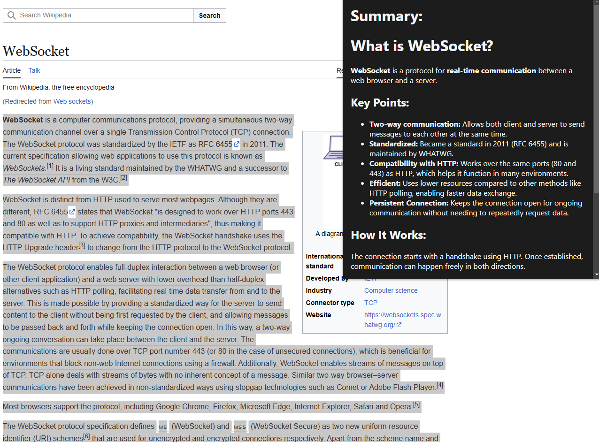

# Chrome Extension (GPT Wrapper) 

+ Chrome Extension that Summarizes selected stuff for you without switching tabs.
+ I set a limit to not summarize if the selected string length is less than 500, There is no need to waste credits for this.
+ After Cloning the respository, make sure to add a `config.js` and add your own API key.

```js
// config.js
export const OPEN_AI_API_KEY = "<YOUR_OPEN_AI_API_KEY>"
export const DEEP_SEEK_API_KEY = "<YOUR_DEEP_SEEK_API_KEY>"
```

